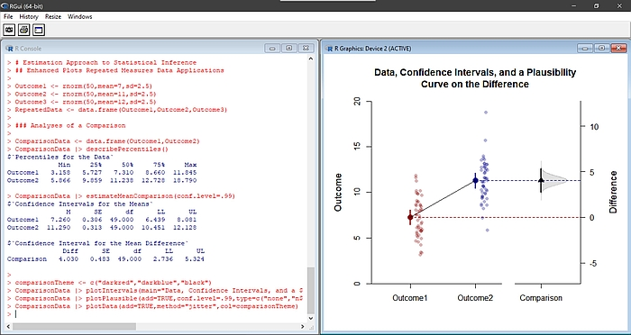

## STATISTICS RESOURCES

### Statistics for Social Science: A Sourcebook of Basic Statistical Methods

The materials in this online textbook are intended to facilitate the connection between standard introductory statistics concepts and their implementation in statistical software. The textbook currently includes: a summary of basic statistical methods; instructions on obtaining basic statistical output using SPSS, jamovi, and JASP; annotated output showing how to calculate and interpret the output; and summaries of how the results should be reported in APA style.

- Wendorf, C. A. (2019). *Statistics for social science: A sourcebook of basic statistical methods.* [https://cwendorf.github.io/Sourcebook](https://cwendorf.github.io/Sourcebook)

<kbd></kbd>

### Estimation Statistics with R

I have worked to make estimation approaches to statistics easier using R. Currently, this includes R packages for implementation of the "new statistics" (EASI), very basic functions for various confidence intervals and sample size planning (DGB), and for contrast coding within established linear models (CALM). Numerous examples (both from my online textbook above and examples from other textbooks) are available. These projects are extensions of the Excel spreadsheets listed below.

- Wendorf, C. A. (2019). *EASI: Estimation Approach to Statistical Inference* [R Package]. [https://cwendorf.github.io/EASI](https://cwendorf.github.io/EASI)
- Wendorf, C. A. (Ed.) (2021). *DGB: Confidence intervals and sample size planning* [R Package]. [https://cwendorf.github.io/DGB](https://cwendorf.github.io/DGB)
- Wendorf, C. A. (2021). *CALM: Contrast Algorithms for Linear Models* [R package]. [https://cwendorf.github.io/CALM](https://cwendorf.github.io/CALM)

<kbd></kbd>

### Basic Analytical Statistics with Excel

I have also developed a collection of Excel spreadsheets that provide real-time calculations and graphs of statistics in four categories: basic statistical distributions (CRUDE), traditional approaches to data analyses (CREATE), arelational and relational intervals for single-factor designs (ARISE), and basic estimation statistics (EASE). Depending on the purpose of the spreadsheet and analysis, they accept raw data and summary statistics input and are available for most basic research designs. Taken together, these resources provide a simple -- yet quite effective -- system that can be used in any typical introductory statistics course. In many respects, they are precursors to the EASI project for R listed above.

- Wendorf, C. A. (2012). *CREATE: Course Resource for Understanding Distributions with Excel* [Excel Spreadsheets]. [https://cwendorf.github.io/BASE/CRUDE](https://cwendorf.github.io/BASE/CRUDE)
- Wendorf, C. A. (2012). *CREATE: Course Resource for Editing and Analyzing Tutorials with Excel* [Excel Spreadsheets]. [https://cwendorf.github.io/BASE/CREATE](https://cwendorf.github.io/BASE/CREATE)
- Wendorf, C. A. (2014). *ARISE: Arelational and Relational Intervals with Excel* [Excel Spreadsheets]. [https://cwendorf.github.io/BASE/ARISE](https://cwendorf.github.io/BASE/ARISE)
- Wendorf, C. A. (2016). *EASE: Estimation Approach to Statistics with Excel* [Excel Spreadsheets]. [https://cwendorf.github.io/BASE/EASE](https://cwendorf.github.io/BASE/EASE)

<kbd></kbd>

