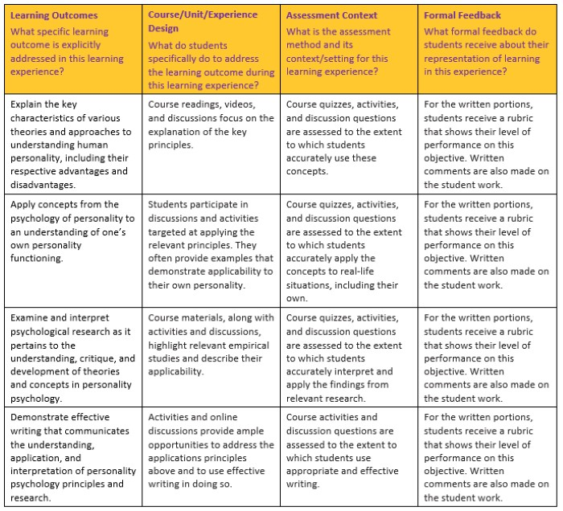
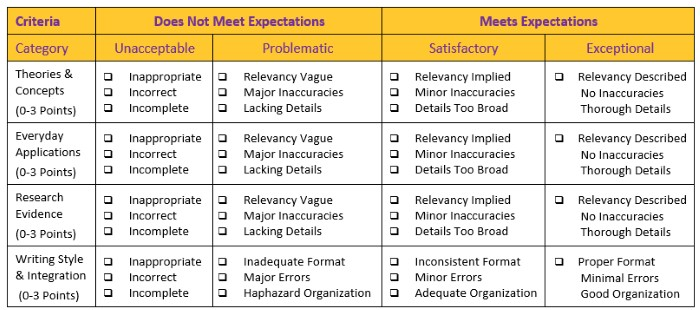

## TEACHING MATERIALS

### My Teaching Philosophy

I work to be very clear about how I approach teaching and about the expectations that I have for student behavior. These documents provide an overview of my teaching philosophy and style. Specifically, they elaborate on the expectations underlying the readings, the classroom environment, and the assessments for each of my classes. Also included are documents that provide study hints for my classes. These are must-read documents for all students taking my classes.

- Wendorf, C. A. (2008). *Teaching philosophy and methods: For all of my courses.* [https://cwendorf.github.io/teaching/Wendorf-TeachingPhilosophy.pdf](https://cwendorf.github.io/teaching/Wendorf-TeachingPhilosophy.pdf)
- Wendorf, C. A. (2009). *Effective text processing strategies: For all of my courses.* [https://cwendorf.github.io/teaching/Wendorf-EffectiveTextProcessingStrategies.pdf](https://cwendorf.github.io/teaching/Wendorf-EffectiveTextProcessingStrategies.pdf)
- Wendorf, C. A. (2009). *Note sheet rules and examples: For all of my courses.* [https://cwendorf.github.io/teaching/Wendorf-NoteSheetExamples.pdf](https://cwendorf.github.io/teaching/Wendorf-NoteSheetExamples.pdf)

<kbd></kbd>

### Course Learning Outcomes

Importantly, I have outlined the primary learning outcomes for each of my courses. These learning outcomes are keyed against the relevant approved APA learning outcomes. Each document describes the learning outcomes, along with the the class activities, assessment methods, and feedback loops that match those learning outcomes. Documents are available for both content (e.g., Social Psychology, Psychology and Culture, etc.) and methodology (i.e., Statistics, Research Methods) courses. These documents are useful for students who want to know more about the "why" behind each class activity, homework assignment, or exam.

- Wendorf, C. A. (2017). *Course learning outcomes: Personality Psychology.* [https://cwendorf.github.io/teaching/Wendorf-LearningOutcomesPersonality.pdf](https://cwendorf.github.io/teaching/Wendorf-LearningOutcomesPersonality.pdf)
- Wendorf, C. A. (2017). *Course learning outcomes: Cultural Psychology.* [https://cwendorf.github.io/teaching/Wendorf-LearningOutcomesCulture.pdf](https://cwendorf.github.io/teaching/Wendorf-LearningOutcomesCulture.pdf)
- Wendorf, C. A. (2017). *Course learning outcomes: Research Methods in Psychology.* [https://cwendorf.github.io/teaching/Wendorf-LearningOutcomesMethods.pdf](https://cwendorf.github.io/teaching/Wendorf-LearningOutcomesMethods.pdf)
- Wendorf, C. A. (2017). *Course learning outcomes: Statistics for Psychologists.* [https://cwendorf.github.io/teaching/Wendorf-LearningOutcomesStatistics.pdf](https://cwendorf.github.io/teaching/Wendorf-LearningOutcomesStatistics.pdf)

<kbd></kbd>

### My Grading System

I have also tried to clearly describe my approach to grading various course assessments (such as essays, problem-based activities, etc.). These documents highlight the common tasks involved in answering questions and solving problems on these assessments, along with a thorough explanation for the grading system used. Separate documents also provide graded examples for both content (e.g., Social Psychology, Psychology and Culture, etc.) and methodology (i.e., Statistics, Research Methods) courses. It is important that students carefully read the grading rubric and examine the samples provided in order to successfully pass the course.

- Wendorf, C. A. (2009). *Grading rubric and explanation: For all of my courses.* [https://cwendorf.github.io/teaching/Wendorf-GradingRubricExplanation.pdf](https://cwendorf.github.io/teaching/Wendorf-GradingRubricExplanation.pdf)
- Wendorf, C. A. (2017). *Graded examples: Social, Cultural, and Personality Psychology.* [https://cwendorf.github.io/teaching/Wendorf-GradingContentExamples.pdf](https://cwendorf.github.io/teaching/Wendorf-GradingContentExamples.pdf)
- Wendorf, C. A. (2017). *Graded examples: Research Methods in Psychology.* [https://cwendorf.github.io/teaching/Wendorf-GradingMethodsExamples.pdf](https://cwendorf.github.io/teaching/Wendorf-GradingMethodsExamples.pdf)
- Wendorf, C. A. (2017). *Graded examples: Statistics for Psychologists.* [https://cwendorf.github.io/teaching/Wendorf-GradingStatisticsExamples.pdf](https://cwendorf.github.io/teaching/Wendorf-GradingStatisticsExamples.pdf)

<kbd></kbd>

