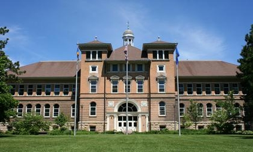
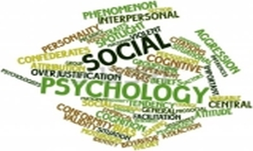
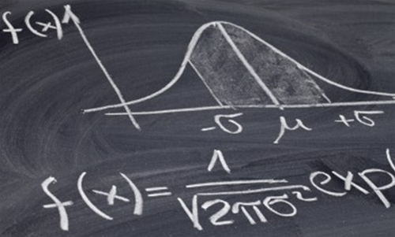

## MY PROFILE

### My Professional Background

I am a Professor of Psychology at the University of Wisconsin - Stevens Point (UWSP). A central Wisconsin native, I came to UWSP in 2001. I served as Department Chair from 2010-2020 and am now the Assistant Dean for the School of Behavioral and Social Sciences.

- **Ph.D.:** [Wayne State University](http://www.clas.wayne.edu/psychology/)
- **M.A.:** [Wayne State University](http://www.clas.wayne.edu/psychology/)
- **B.S.:** [University of Wisconsin Oshkosh](https://www.uwosh.edu/psychology)
- **A.A.S.:** [University of Wisconsin - Marathon County](https://www.uwsp.edu/wausau/Pages/default.aspx)

### My Professional Interests

Broadly speaking, I am interested in social and cultural psychology, statistical methods, and the scholarship of teaching and learning. Of course, these interests are not mutually exclusive; in fact, most of my work spans more than one of these categories.

- **Social and Cultural Psychology:** Justice, fairness, and morality; social and political values; cultural and evolutionary psychology.
- **Statistics and Research Methods:** Confidence intervals; effect sizes; structural equation modeling; multilevel modeling.
- **Scholarship of Teaching and Learning:** Social psychology of education; student evaluations of teaching; faculty development.

### Materials on this Site

I believe in clear and open practices in higher education. All of my summary teaching materials, links to all of my research publications and student independent projects, and portals to my open source statistics resources are all available on this website.

- [**Teaching Materials:**](./teaching/) My teaching philosophy; learning outcomes for all of my courses; my grading system with examples.
- [**Research Publications:**](./research/) Journal article publications (with links); regional and international conference presentations.
- [**Statistics Resources:**](./resources/) Sourcebook of statistical methods; estimation statistics package for R; Excel spreadsheets for basic statistical methods.
- [**Student Projects:**](./projects/) Independent study descriptions and downloads; listing of all independent study projects.

