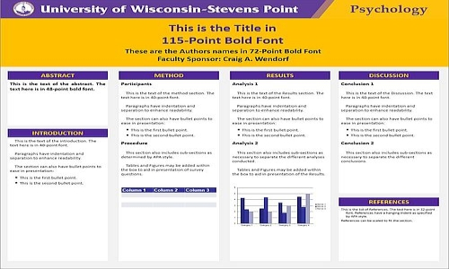
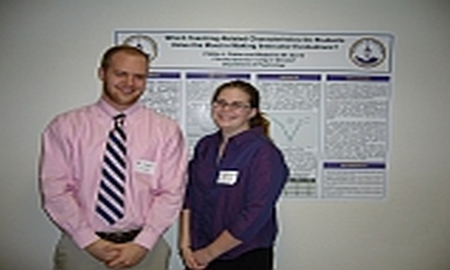

# Student Projects

## Overview of Independent Study

Like most of the Psychology faculty, I regularly involve students in my research. Students can become involved in any phase of a research project, from writing a research proposal and designing the study to analyzing and presenting the findings. Although students who want to be part of an entire project become involved on a three-semester basis, many students are involved for only a portion of a project. I typically offer two credts of PSYC 399 (Independent Study) for each semester of involvement.

*   Wendorf, C. A. (2012). _Independent Study: Study construction projects._ [https://cwendorf.github.io/projects/Wendorf-StudyConstructionProject.pdf](https://cwendorf.github.io/projects/Wendorf-StudyConstructionProject.pdf)
*   Wendorf, C. A. (2012). _Independent Study: Study implementation projects._ [https://cwendorf.github.io/projects/Wendorf-StudyImplementationProject.pdf](https://cwendorf.github.io/projects/Wendorf-StudyImplementationProject.pdf)
*   Wendorf, C. A. (2012). _Independent Study: Study analysis projects._ [https://cwendorf.github.io/projects/Wendorf-StudyAnalysisProject.pdf](https://cwendorf.github.io/projects/Wendorf-StudyAnalysisProject.pdf)
*   Wendorf, C. A. (2012). _Independent Study: Research poster template_ [PowerPoint File]. [https://cwendorf.github.io/projects/Wendorf-PosterTemplateGold.pptx](https://cwendorf.github.io/projects/Wendorf-PosterTemplateGold.pptx)
*   Wendorf, C. A. (2012). _Independent Study: Self-assessment and reflection_ [Word Document]. [https://cwendorf.github.io/projects/Wendorf-SelfAssessmentReflection.docx](https://cwendorf.github.io/projects/Wendorf-SelfAssessmentReflection.docx)

## Samples of Independent Study Projects

My students tend to do projects that closely align with my research interests. However, my interests have varied considerably over time and so the student projects tend to be quite varied as well. The following completed projects have been presented at the annual UWSP Letters and Science Undergraduate Research Symposium.

*   Stanton, S., & Wierzba, B. (2016, May). _Surely you are not a sarcastic person: Measuring sarcasm as a personality trait._ Poster presented at the 17th annual Letters and Science Undergraduate Research Symposium, University of Wisconsin – Stevens Point. (Faculty Sponsor: Craig A. Wendorf)
*   Zajac, M. L., & Vettrus, J. A. (2016, May). _People do a great job of interpreting written sarcasm: The importance of context in evaluating intent._ Poster presented at the 17th annual Letters and Science Undergraduate Research Symposium, University of Wisconsin – Stevens Point. (Faculty Sponsor: Craig A. Wendorf)
*   Wouters, A. M. (2014, May). _The prevalence of fraudulent academic excuses at UWSP._ Poster presented at the 15th annual Letters and Science Undergraduate Research Symposium, University of Wisconsin – Stevens Point. (Faculty Sponsor: Craig A. Wendorf)
*   Riley, B. (2014, May). _Perceptions of fairness impact university satisfaction, identification, and extrarole behaviors._ Poster presented at the 15th annual Letters and Science Undergraduate Research Symposium, University of Wisconsin – Stevens Point. (Faculty Sponsor: Craig A. Wendorf)
*   Calhoun, D. M., & Wouters, A. M. (2013, April). _Fraudulent academic excuses: Perceptions of appropriateness and believability._ Poster presented at the 14th annual Letters and Science Undergraduate Research Symposium, University of Wisconsin – Stevens Point. (Faculty Sponsor: Craig A. Wendorf)
*   Timm, K. K. (2011, April). _From justice to forgiveness: Stress, resilience, and life satisfaction as mediators._ Poster presented at the 12th annual Letters and Science Undergraduate Research Symposium, University of Wisconsin – Stevens Point. (Faculty Sponsor: Craig A. Wendorf)
*   Potter, P. J., & David, M. M. (2011, April). _Online comments about instructors: What is recalled and what might be transmitted?_ Poster presented at the 12th annual Letters and Science Undergraduate Research Symposium, University of Wisconsin – Stevens Point. (Faculty Sponsor: Craig A. Wendorf)
*   Potter, P. J., & David, M. M. (2011, April). _Which teaching-related characteristics do students value the most in making instructor evaluations?_ Poster presented at the 12th annual Letters and Science Undergraduate Research Symposium, University of Wisconsin – Stevens Point. (Faculty Sponsor: Craig A. Wendorf)
*   Potter, P. J., & Windt, A. J. (2010, April). _Social transmission of online comments about instructors._ Poster presented at the 11th annual Letters and Science Undergraduate Research Symposium, University of Wisconsin – Stevens Point. (Faculty Sponsor: Craig A. Wendorf)
*   Glaman, R. B., & Groshek, C. J. (2010, April). _Factors underlying political views: Regulation, compassion, and (not) awareness of death._ Poster presented at the 11th annual Letters and Science Undergraduate Research Symposium, University of Wisconsin – Stevens Point. (Faculty Sponsor: Craig A. Wendorf)
*   Kalpinski, R., & Gonzales-Martin, A. (2009, April). _Judgments about web-based rumors of college instructors._ Poster presented at the 10th annual Letters and Science Undergraduate Research Symposium, University of Wisconsin – Stevens Point. (Faculty Sponsor: Craig A. Wendorf)
*   Miyanaka, M. (2009, April). _The impact of parents' education on intercultural preparedness._ Poster presented at the 10th annual Letters and Science Undergraduate Research Symposium, University of Wisconsin – Stevens Point. (Faculty Sponsor: Craig A. Wendorf)
*   Yoder, N., Holden, S., & Smith, M. (2008, April). _Content analysis of students’ reasons for studying psychology._ Poster presented at the 9th annual Letters and Science Undergraduate Research Symposium, University of Wisconsin – Stevens Point. (Faculty Co-sponsors: Amy Herstein Gervasio and Craig A. Wendorf)
*   Yoder, N. F., Smith, M. M., & VanBerkel, C. (2008, May). _Validating a psychology as a helping profession scale._ Poster presented at the 9th annual Letters and Science Undergraduate Research Symposium, University of Wisconsin – Stevens Point. (Faculty Co-sponsors: Amy Herstein Gervasio and Craig A. Wendorf)
*   Kastner, A. N., & Sworsky, S. P. (2007, April). _Where is justice in the realm of values and politics?_ Poster presented at the 8th annual Letters and Science Undergraduate Research Symposium, University of Wisconsin – Stevens Point. (Faculty Sponsor: Craig A. Wendorf)
*   Patovisti, G. M., & Meyer, N. M. (2007, April). _Fairness concerns and perceptions of accused terrorists._ Poster presented at the 8th annual Letters and Science Undergraduate Research Symposium, University of Wisconsin – Stevens Point. (Faculty Sponsor: Craig A. Wendorf)
*   Aird, C. M., & McKeel, A. N. (2007, April). _What do millennial students expect in the college classroom?_ Poster presented at the 8th annual Letters and Science Undergraduate Research Symposium, University of Wisconsin – Stevens Point. (Faculty Sponsor: Craig A. Wendorf)
*   Van Berkel, C., Hoffman, S., Smith, M., Yoder, N., Peaslee, A., & Wilcher, J. (2007, April). _Development of two scales for understanding choice of a psychology major._ Poster presented at the 8th annual Letters and Science Undergraduate Research Symposium, University of Wisconsin – Stevens Point. (Faculty Co-sponsors: Amy Herstein Gervasio and Craig A. Wendorf)
*   Peaslee, A. M., Teuscher, S. E., & Trost, J. E. (2006, April). _Survey of learning goals in psychology._ Poster presented at the 7th annual Letters and Science Undergraduate Research Symposium, University of Wisconsin – Stevens Point. (Faculty Co-sponsors: Amy Herstein Gervasio and Craig A. Wendorf)

