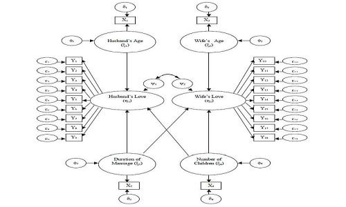
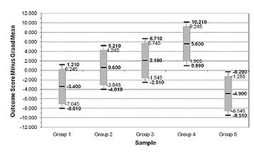
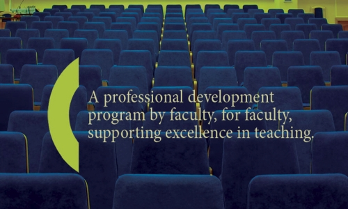

# Research Publications

## Social and Cultural Psychology

As a social and cultural psychologist, I have a broad interest in people's social behavior, especially as it is both common and distinctive across cultures. One area of substantive research centers on a general theme: identifying people's concerns about what is fair, just, and proper in both basic and applied settings. In a separate thread of research, my primary involvement in cultural and evolutionary psychology for several years had been as part of a large-scale cross-cultural study of marital satisfaction.

*   Wendorf, C. A., & Lucas, T. (2018). Getting it right: Why invariance testing with respect to gender and culture is important. In G. Weisfeld, C. Weisfeld, & L. Dillon (Eds.), _Psychology of marriage: An evolutionary and cross-cultural view_ (pp. 41-52). Lexington Books. [https://rowman.com/ISBN/9781498541251/](https://rowman.com/ISBN/9781498541251/The-Psychology-of-Marriage-An-Evolutionary-and-Cross-Cultural-View)
*   Lucas, T., Kamble, S. V., Wu, M. S., Zhdanova, L., & Wendorf, C. A. (2016). Distributive and procedural justice for self and others: Measurement invariance and links to life satisfaction in four cultures. _Journal of Cross-Cultural Psychology, 47,_ 234–248\. [https://doi.org/10.1177%2F0022022115615962](https://doi.org/10.1177%2F0022022115615962)
*   Lucas, T., Zhdanova, L., Wendorf, C. A., & Alexander, S. (2013). Beliefs for self and others: Multilevel associations with life satisfaction and self-rated health. _Journal of Happiness Studies, 14,_ 1325-1341\. [https://doi.org/10.1007/s10902-012-9387-6](https://doi.org/10.1007/s10902-012-9387-6)
*   Lucas, T., & Wendorf, C. A. (2012). Perceived justice and well-being at work: Why and for whom do unethical practices matter? In R. A. Giacalone and M. D. Promislo (Eds.), _Handbook of unethical work behavior: Implications for individual well-being_ (pp. 237-252). M. E. Sharpe. [https://www.routledge.com/p/book/9780765632562](https://www.routledge.com/p/book/9780765632562)
*   Wendorf, C. A., Lucas, T., İmamoğlu, E. O., Weisfeld, C. C., & Weisfeld, G. E. (2011). Marital satisfaction in three countries: Does the number of children have an impact after accounting for other marital demographics? _Journal of Cross-Cultural Psychology, 42,_ 340-354\. [https://doi.org/10.1177%2F0022022110362637](https://doi.org/10.1177%2F0022022110362637)
*   Lucas, T., Parkhill, M. R., Wendorf, C. A., İmamoğlu, E. O., Weisfeld, C. C., Weisfeld, G. E., & Shen, J. (2008). Cultural and evolutionary components of marital satisfaction: A multidimensional assessment of measurement invariance. _Journal of Cross-Cultural Psychology, 39,_ 109-123\. [https://doi.org/10.1177%2F0022022107311969](https://doi.org/10.1177%2F0022022107311969)
*   Lucas, T., Wendorf, C. A., İmamoğlu, E. O., Shen, J., Parkhill, M. R., Weisfeld, C. C., & Weisfeld, G. E. (2004). Marital satisfaction in four cultures as a function of homogamy, male dominance, and female attractiveness. _Sexualities, Evolution & Gender, 6,_ 97-130\. [https://doi.org/10.1080/14616660412331327518](https://doi.org/10.1080/14616660412331327518)
*   Franks, M. M., Wendorf, C. A., Gonzalez, R., & Ketterer, M. (2004). Aid and influence: Health promoting exchanges of older married partners. _Journal of Social and Personal Relationships, 21,_ 431-445\. [https://doi.org/10.1177%2F0265407504044839](https://doi.org/10.1177%2F0265407504044839)
*   Wendorf, C. A., Alexander, S., & Firestone, I. J. (2002). Social justice and moral reasoning: An empirical integration of two paradigms in psychological research. _Social Justice Research,15_(1), 19-39\. [https://doi.org/10.1023/A:1016093614893](https://doi.org/10.1023/A:1016093614893)
*   Weisfeld, G. E., & Wendorf, C. A. (2000). The IDS and discrete emotions theory. In L. Sloman and P. Gilbert (Eds.), _Subordination and defeat: An evolutionary approach to mood disorders and their therapy_ (pp. 121-146). Lawrence Erlbaum.
*   Wendorf, C. A. (2001). History of American morality research, 1894-1932. _History of Psychology, 4,_ 272-288\. [https://dx.doi.org/10.1037/1093-4510.4.3.272](https://dx.doi.org/10.1037/1093-4510.4.3.272)

[[Conference Presentations](javascript:;)]

### Conference Presentations

*   Lucas, T., Wu, M. S., Kamble, S. V., Zhdanova, L., & Wendorf, C. A. (2012). _Procedural and distributive justice beliefs for self and others: Measurement invariance and links to well-being in individualistic and collectivistic cultures._ Poster presented at the 14th biennial meeting of the [International Society for Justice Research](http://www.isjr.org/), Rishon LeZion, Israel.
*   Wendorf, C. A., Kastner, A. N., & Sworsky, S. P. (2007, May). _Where is justice in the realm of values and politics?_ Poster presented at the 79th annual meeting of the [Midwestern Psychological Association](http://midwesternpsych.org/), Chicago, IL.
*   Wendorf, C. A., & Sonnentag, T. L. (2007, May). _Similarity as the basis for distributive and retributive justice._ Poster presented at the 79th annual meeting of the [Midwestern Psychological Association](http://midwesternpsych.org/), Chicago, IL.
*   Wendorf, C.A., Parker, M. T., Seefelt, J. L., Kosmalski, J. A., & Teo, Y. P. (2006, May). _Exclusion from fairness concerns in the wake of terror._ Paper presented at the 78th annual meeting of the [Midwestern Psychological Association](http://midwesternpsych.org/), Chicago, IL.
*   Cano, A., Roos, M. T., Geisser, M., & Wendorf, C. A. (2004, November). _Couples’ life stressors as correlates of pain and psychological distress._ Symposia presentation at the 38th annual meeting of the Association for the Advancement of Behavior Therapy, New Orleans, LA.
*   Wendorf, C. A. (2004, April). _The structure and determinants of justice criteria importance._ Poster presented at the 76th annual meeting of the [Midwestern Psychological Association](http://midwesternpsych.org/), Chicago, IL.
*   Wendorf, C. A., & Firestone, I. J. (2004, April). _Functional morals: Attitude functions and moral reasoning._ Poster presented at the 76th annual meeting of the [Midwestern Psychological Association](http://midwesternpsych.org/), Chicago, IL.
*   Parkhill, M. R., Lucas, T. W., Wendorf, C. A., İmamoğlu, E. O., & Shen, J. (2003, June). _The meaning of marriage: Cross-cultural invariance testing of a marital satisfaction measure._ Paper presented at the 15th annual meeting of the [Human Behavior and Evolution Society](http://www.hbes.com/), Lincoln, NE.
*   Wendorf, C. A., Weisfeld, G. E., Parkhill, M. R, Lucas, T. W., & Weisfeld, C. C. (2002, August). _Marriage within the extended family in four cultures._ Paper presented to the Congress of the [International Society for Human Ethology](http://ishe.org/), Montreal, Canada.
*   Weisfeld, G. E., Weisfeld, C. C., İmamoğlu, E. O., Shen, J., & Wendorf, C. A. (2001, June). _Cultural differences in the impact of number of children on marital satisfaction._ Paper presented at the 13th annual meeting of the [Human Behavior and Evolution Society](http://www.hbes.com/), London, UK.
*   Wendorf, C. A., & Alexander, S. (2001, May). _Justice context and changes in fairness-related criteria over time._ Poster presented at the 73rd annual meeting of the [Midwestern Psychological Association](http://midwesternpsych.org/), Chicago, IL.
*   Weisfeld, G. E., Wendorf, C. A., Weisfeld, C. C., İmamoğlu, E. O., & Shen, J. (2000, August). _Marriage and emotional well-being in three cultures._ Paper presented at the Congress of the [International Society for Human Ethology](http://ishe.org/), Salamanca, Spain.
*   Weisfeld, C. C., Wendorf, C. A., Weisfeld, G. E., Shen, J., & İmamoğlu, E.O. (2000, August). _Sex and cultural differences in marital satisfaction._ Paper presented at the Congress of the [International Society for Human Ethology](http://ishe.org/), Salamanca, Spain.
*   Dickson, M. W., & Wendorf, C. A. (1999, August). _Manager's implicit theories of motivation: How managers think motivation "works."_ Poster presented at the 107th annual meeting of the [American Psychological Association](http://www.apa.org), Boston, MA.
*   Wendorf, C. A., Firestone, I. J., & Alexander, S. (1999, August). _Social justice and moral reasoning: Comparing two traditions of psychological research._ Poster presented at the 107th annual meeting of the [American Psychological Association](http://www.apa.org), Boston, MA.
*   Wendorf, C. A., & Alexander, S. (1999, April). _Distributive and procedural justice in a moral reasoning context._ Poster presented at the 71st annual meeting of the [Midwestern Psychological Association](http://midwesternpsych.org/), Chicago, IL.

## Statistical Methods

I am interested in statistical methods quite generally. For instance, my research on married couples has led me to develop and compare structural equation modeling and multilevel modeling approaches to dyadic data. From a more teaching-oriented perspective, I am interested in developing statistical methods that facilitate the presentation of statistical material. This is evident in my work on structural equation modeling, multiple regression coding, and confidence intervals.

*   Wendorf, C. A. (2012). Drawing inferences from multiple intervals in the single-factor design: Derivations, clarifications, extensions, and representations. _Methodology: European Journal of Research Methods for the Behavioral and Social Sciences, 8,_ 125-133\. [https://doi.org/10.1027/1614-2241/a000045](https://doi.org/10.1027/1614-2241/a000045)
*   Wendorf, C. A. (2004). Primer on multiple regression coding: Common forms and the additional case of repeated contrasts. _Understanding Statistics, 3,_ 47-57\. [https://doi.org/10.1207/s15328031us0301_3](https://doi.org/10.1207/s15328031us0301_3)
*   Wendorf, C. A. (2002). Comparisons of structural equation modeling and hierarchical linear modeling approaches to couples' data. _Structural Equation Modeling, 9,_ 126-140\. [https://doi.org/10.1207/S15328007SEM0901_7](https://doi.org/10.1207/S15328007SEM0901_7)

[[Conference Presentations](javascript:;)]

### Conference Presentations

*   Calin-Jageman, R., & Wendorf, C. A. (2016, October). _The new statistics: Practical examples for promoting change in statistics curricula._ Workshop conducted at the [Society for the Teaching of Psychology's (STP)](http://teachpsych.org/) [Annual Conference on Teaching (ACT)](http://teachpsych.org/conferences/act.php), Decatur, GA.

## Scholarship of Teaching and Learning

I have a broad interest in the scholarship of teaching and learning, especially as relevant to psychology. As one example of applying psychological theory to teaching, I have adapted the psychology of fairness to an understanding of fairness dynamics in the classroom. Other studies have examined the psychology behind students' beliefs about grading and the psychology major as a whole.

*   Gervasio, A. H., Wendorf, C. A., & Yoder, N. F. (2010). Validating a psychology as a helping profession scale. _Teaching of Psychology, 37_, 107-113\. [https://doi.org/10.1080%2F00986281003609199](https://doi.org/10.1080%2F00986281003609199)
*   Wendorf, C. A., & Alexander, S. (2005). The influence of individual and class-level fairness-related perceptions on student satisfaction. _Contemporary Educational Psychology, 30,_ 190-206\. [https://doi.org/10.1016/j.cedpsych.2004.07.003](https://doi.org/10.1016/j.cedpsych.2004.07.003)
*   Wendorf, C. A. (2002). GPA and changes in (great) grade expectations. _Teaching of Psychology, 29,_ 136-138\. [https://doi.org/10.1207%2FS15328023TOP2902_13](https://doi.org/10.1207%2FS15328023TOP2902_13)

[[Conference Presentations](javascript:;)]

### Conference Presentations

*   Wendorf, C. A. (2013, May). _Doing justice to the classroom: Fairness in teaching and learning._ Presentation at the 13th annual Enhancing the Teaching Psychology Conference, University of Wisconsin – Stevens Point.
*   Lewis, J., Wendorf, C. A., & Nemeth, R. (2009, May). _Learning about teaching: Lesson study and beyond._ Presentation at the 9th annual Enhancing the Teaching of Psychology Conference, University of Wisconsin – Stevens Point.
*   Gervasio, A. H., & Wendorf, C. A. (2008, May). _The search for students’ motivation for studying psychology._ Presentation at the 8th annual Enhancing the Teaching of Psychology Conference, University of Wisconsin Oshkosh.
*   Gervasio, A. H., Wendorf, C. A., Yoder, N. F., Smith, M. M., & VanBerkel, C. (2008, May). _Validating a psychology as a helping profession scale._ Poster presented at the 80th annual meeting of the [Midwestern Psychological Association](http://midwesternpsych.org/), Chicago, IL.
*   Wendorf, C. A., Nemeth, R., & Lewis, J. (2007, October). _Obedience to PowerPoint: A pedagogical view._ Workshop conducted at the [Lilly Conference on College and University Teaching – North](http://www.facit.cmich.edu/lilly/default.shtml), Traverse City, MI.
*   Wendorf, C. A., Aird, C. M., & McKeel, A. N. (2007, March). _What do Millennial students expect in the college classroom? Stereotypes, perceptions, and preferences._ Invited plenary address at the first annual [UW-System Office of Professional and Instructional Development (OPID)](https://www.wisconsin.edu/opid/) Spring Conference, Madison, WI.
*   Wendorf, C. A. (2006, September). _College and classroom expectations: Are millennial students different?_ Workshop conducted for the annual fall meeting of the [UW-System Office of Professional and Instructional Development (OPID)](https://www.wisconsin.edu/opid/) Council, Madison, WI.
*   Parker, M. T., Seefelt, J. L., Sheldon, D. P., & Wendorf, C. A. (2006, May). _Violations of justice and its impact on evaluations of instructors._ Paper presented at the 78th annual meeting of the [Midwestern Psychological Association](http://midwesternpsych.org/), Chicago, IL.
*   Parker, M. T., Seefelt, J. L., & Wendorf, C. A. (2006, May). _The presence of implicit theories of motivation in the classroom._ Paper presented at the 78th annual meeting of the [Midwestern Psychological Association](http://midwesternpsych.org/), Chicago, IL.
*   Wilson, L. O., Wendorf, C. A., Loy, M., & Gingrasso, S. H. (2006, April). _The FACETS Design: How scaffolds can help and support your SoTL work._ Workshop conducted at the [Carnegie Academy for the Scholarship of Teaching and Learning (CASTL)](http://www.carnegiefoundation.org/) Colloquium on the Scholarship of Teaching and Learning: Evidence, Impact and Momentum, Madison, WI.
*   Wilson, L. O., Gingrasso, S. H., Loy, M. J., & Wendorf, C. A. (2005, October). _Rethinking SoTL work: Giving folks what they really need in order to grow in the scholarship of teaching and learning._ Workshop conducted at the annual meeting of the [International Society for the Scholarship of Teaching and Learning (ISSOTL)](http://www.issotl.com/issotl15/), Vancouver, British Columbia.
*   Wilson, L. O., Loy, M., & Gingrasso, S. H., & Wendorf, C. A. (2005, September). _Legacies and lessons: The evolution of grassroots professional development._ Workshop conducted at annual meeting of the [Professional and Organizational Development Network Conference](http://podnetwork.org/), Milwaukee, WI.
*   Wendorf, C. A., Wilson, L. O., Loy, M. J., & Gingrasso, S. H. (2005, September). _Meet the midwest millennials: Implications of generational and demographic characteristics for higher education._ Workshop conducted at the [Lilly Conference on College and University Teaching – North](http://www.facit.cmich.edu/lilly/default.shtml), Traverse City, MI.
*   Wilson, L. O., Wendorf, C. A., Loy, M., & Gingrasso, S. H. (2005, April). _Radical course revision: The promise of backwards design._ Workshop conducted at the [Office of Professional and Instructional Development’s (OPID)](https://www.wisconsin.edu/opid/) Focus on Teaching and Learning Conference, Madison, WI.
*   Wilson, L. O., Loy, M., Wendorf, C. A., & Gingrasso, S. H. (2005, March). _Speaking millennial: Understanding and teaching a new generation of students._ Workshop conducted at the [Lilly Conference on College and University Teaching – West](http://www.iats.com/), Pomona, CA.
*   Wilson, L. O., Wendorf, C. A., Loy, M., & Gingrasso, S. H. (2005, March). _The impact of a Faculty Alliance for Creating and Enhancing Teaching Strategies (FACETS)._ Poster presented at the [Carnegie Academy for the Scholarship of Teaching and Learning (CASTL)](http://www.carnegiefoundation.org/) Colloquium on the Scholarship of Teaching and Learning: Evidence of Student Learning, Atlanta, GA.

