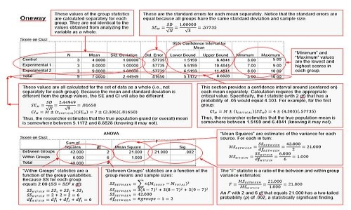
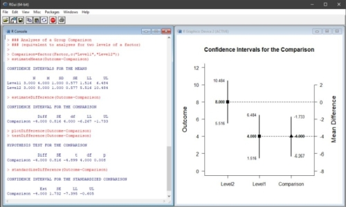
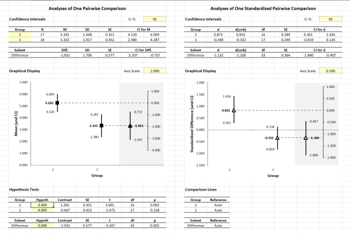

# Statistics Resources

## Statistics for Social Science: A Sourcebook of Basic Statistical Methods

The materials in this online textbook are intended to facilitate the connection between standard introductory statistics concepts and their implementation in statistical software. The textbook currently includes: a summary of basic statistical methods; instructions on obtaining basic statistical output using SPSS, jamovi, and JASP; annotated output showing how to calculate and interpret the output; and summaries of how the results should be reported in APA style.

*   Wendorf, C. A. (2019). _Statistics for social science: A sourcebook of basic statistical methods._ [https://cwendorf.github.io/Sourcebook](https://cwendorf.github.io/Sourcebook)

## EASI: Estimation Approach to Statistical Inference

EASI is a package for R that implements features of estimation statistics. Primary functions calculate, test, and plot confidence intervals for means, mean differences, and mean contrasts for between- and within-subjects single-factor, factorial, and mixed designs. They can take either raw data or summary statistics as input. Additional functions calculate the standardized effect sizes and statistical significance tests associated with comparions among the groups and variables. Numerous tutorial examples (from my online textbook above) and examples from other textbooks are available. This R project extends the analysis options beyond what is available in the Excel spreadsheets listed below.

*   Wendorf, C. A. (2019). _EASI: Estimation Approach to Statistical Inference_ [R Package]. [https://cwendorf.github.io/EASI](https://cwendorf.github.io/EASI)

## BASE: Basic Analytical Statistics with Excel

BASE is a collection of Excel spreadsheets that provide real-time calculations and graphs of statistics in three categories: traditional approaches to data analyses (CREATE), arelational and relational intervals for single-factor designs (ARISE), and basic estimation statistics (EASE). Depending on the purpose of the spreadsheet and analysis, they accept raw data and summary statistics input and are available for most basic research designs. Taken together, these resources provide a simple -- yet quite effective -- system that can be used in any typical introductory statistics course. In many respects, they are precursors to the EASI project for R listed above.

*   Wendorf, C. A. (2012). _CREATE: Course Resource for Editing and Analyzing Tutorials with Excel_ [Excel Spreadsheets]. [https://cwendorf.github.io/BASE/CREATE](https://cwendorf.github.io/BASE/CREATE)
*   Wendorf, C. A. (2014). _ARISE: Arelational and Relational Intervals with Excel_ [Excel Spreadsheets]. [https://cwendorf.github.io/BASE/ARISE](https://cwendorf.github.io/BASE/ARISE)
*   Wendorf, C. A. (2016). _EASE: Estimation Approach to Statistics with Excel_ [Excel Spreadsheets]. [https://cwendorf.github.io/BASE/EASE](https://cwendorf.github.io/BASE/EASE)

